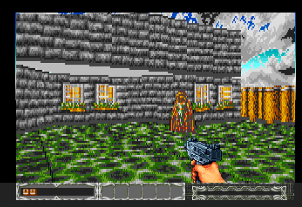
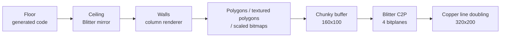
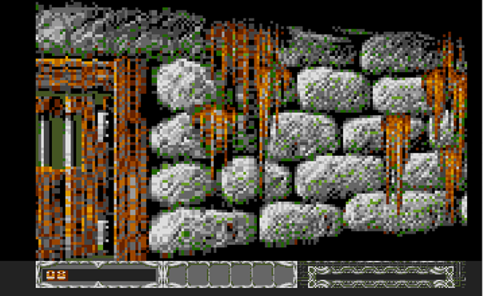
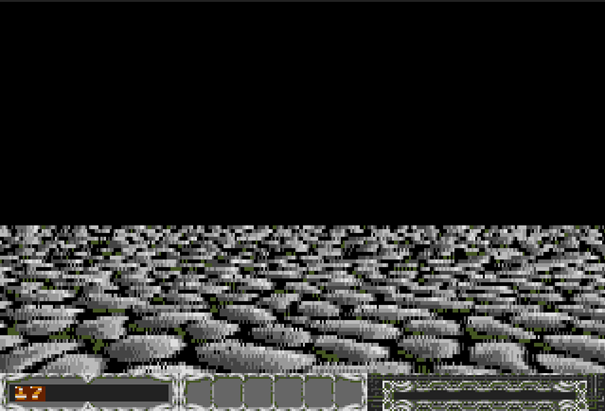
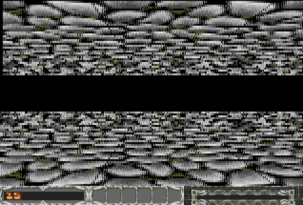
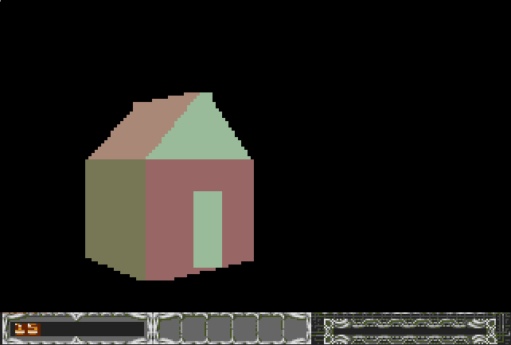
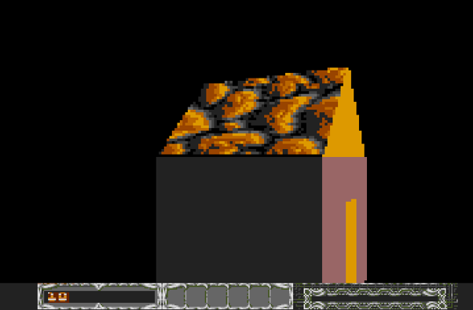
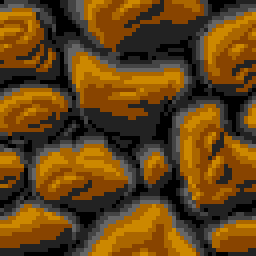
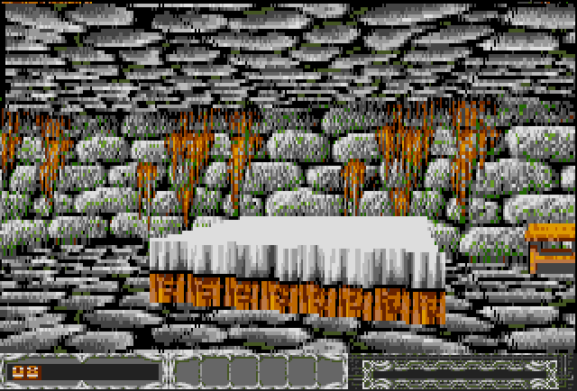

# Amiga3dEngine

**A chunky-buffer 3D engine for the stock Amiga 500 (68000 @ 7 MHz, OCS, no Fast RAM required).**

Textured walls, textured floors *and* ceilings, flat-shaded polygons, affine texture-mapped polygons and scaled bitmaps – all rendered into a 160×100 chunky buffer and converted to bitplanes by the Blitter.



The engine was developed alongside an article series ("Amiga Future"). This README summarizes the key ideas of every part of the series; the source code in this repository is the reference implementation.

---

## Table of contents

1. [Overview](#overview)
2. [Rendering pipeline](#rendering-pipeline)
3. [Chunky-to-Planar with the Blitter](#1-chunky-to-planar-with-the-blitter)
4. [Wall rendering (pseudo raycasting)](#2-wall-rendering-pseudo-raycasting)
5. [Floor and ceiling rendering](#3-floor-and-ceiling-rendering)
6. [Flat polygon filling](#4-flat-polygon-filling)
7. [Affine texture mapping](#5-affine-texture-mapping)
8. [Performance](#performance)
9. [Limitations](#limitations)
10. [Related repositories](#related-repositories)
11. [Credits](#credits)

---

## Overview

The Amiga has no chunky pixel mode. Every pixel is spread across several bitplanes, which makes per-pixel work such as texture mapping far too slow if done directly. PCs with VGA cards had a byte-per-pixel mode, and this is often cited as the reason the Amiga missed the *Doom* wave.

This engine takes the classic route around the problem:

- Render everything into a **chunky buffer** (1 byte = 1 pixel = colour index).
- Convert the buffer to bitplanes with a fast **C2P (chunky-to-planar)** routine.

To make this feasible on a plain A500, the engine uses a **160×100 chunky buffer with 16 colours**, displayed as **320×200** by doubling pixels horizontally (during C2P) and vertically (via the Copper).

The overall philosophy is: *precompute everything that can be precomputed, bake it into generated code, and let the Blitter do whatever the 68000 is bad at.*

| Technique | Where it is used |
|---|---|
| Blitter-based C2P with pre-"stretched" colour values | Chunky → bitplanes |
| Unrolled code + jump tables | Wall columns, polygon spans |
| Precomputed texture step tables | Wall texturing |
| Code generation (texel offsets baked into instructions) | Floor rendering |
| Blitter vertical mirroring | Ceiling rendering |
| Sorting network instead of sort loop | Polygon vertex ordering |
| Integer Bresenham edge stepping | Polygon edges |
| Longword writes + Duff's device | Flat polygon fill |
| 256-byte texture pitch + 8.8 fixed point | Affine texture mapping |
| Painter's algorithm (back to front) | Visibility – no Z-buffer |

---

## Rendering pipeline



Floor and ceiling are drawn first because they cover the whole background. Walls and objects are then drawn strictly back to front (painter's algorithm), so nearer pixels overwrite farther ones. A Z-buffer is not an option on the A500 in terms of either memory or speed.

---

## 1. Chunky-to-Planar with the Blitter

On the A500 the Blitter is considerably faster than the 68000 for the AND/OR/shift operations that C2P consists of. A blitter cycle costs 4–8 clock ticks per word depending on the enabled DMA channels (A is free, B adds 2 ticks, using both C and D adds 2 ticks).

### Pre-stretched colour values

To avoid the costly bit doubling, each colour index is stored "stretched": every bit is duplicated. Since the chunky buffer is 160 pixels wide but the screen is 320, the doubled bits directly yield two identical screen pixels.

| Colour | Plain | Stretched |
|---|---|---|
| 1 | `0000 0001` | `0000 0011` |
| 2 | `0000 0010` | `0000 1100` |
| 3 | `0000 0011` | `0000 1111` |
| 4 | `0000 0100` | `0011 0000` |

A pixel is still set by writing a single byte – there is no restriction on how the chunky buffer is filled.

### Three blit passes

With `a, b, c, d` each denoting a 2-bit group (`00` or `11`) for target bitplanes 3, 2, 1, 0, a longword looks like `a1b1c1d1 a2b2c2d2 a3b3c3d3 a4b4c4d4`.

1. **Merge** – Source A = word *n*, source B = word *n+1* shifted right by 4, C disabled and used as constant mask `$F0F0`. The result is half the size of the chunky buffer.
2. **Build bytes** – A and B both point to the *last* word of the previous result (descending mode is required for left shifts), B shifted left by 6, mask `$CCCC`. The result contains finished bytes for one plane.
3. **Join** – A = word *n*, B = word *n+1* shifted right by 8, mask `$FF00`. The output is written straight into the target bitplane.

Steps 2 and 3 are repeated with different shifts for the other planes, giving **10 blits in total**. Only A and B are enabled (C is a constant), so each word costs 6 cycles:

```
4 · H · n · (32 + W/4)  =  4 · 100 · 6 · 72  =  172,800 cycles
```

With ~141,800 cycles per PAL frame, a full conversion takes **under 2 frames**, provided the Blitter has priority (`BLTPRI` set). Otherwise it must yield every 4th cycle to the CPU.

The vertical doubling is done by the Copper, which alternates the bitplane modulo per line so that every line is either repeated or advanced.

| 160×100 → 320×200 | Amiga 500 | Amiga 1200 |
|---|---|---|
| 2×2 C2P Blitter | 25 fps | 25 fps |
| 2×2 C2P Kalms (`c2p2x1_4_c5_bm.s`) | 13 fps | 50 fps |

On the A1200 the Blitter version has no advantage: the 68020 is much faster, while the Blitter still runs at the old system clock.

---

## 2. Wall rendering (pseudo raycasting)



Strictly speaking this is not classic raycasting but a hybrid. Wall positions are computed with ordinary 3D math (matrix multiplication and perspective projection). Since the player can only rotate around the vertical axis, the number of multiplications is small. The *raycasting* part is the rendering: every wall is drawn **column by column**, each column from bottom to top, with the texture stretched to the projected wall height.

The time budget is tight: with C2P taking ~2 frames, reaching 15 fps leaves roughly 500,000 CPU cycles to fill 16,000 pixels – about **30 cycles per pixel**.

Wall textures (taken from *Ambermoon*) are 128×80 pixels, 16 colours.

### Unrolled columns with jump tables

Instead of a loop, there is a fully unrolled code block for every possible column height. Precomputed texture offsets are baked directly into the instructions, and a jump table selects the entry point:

```asm
    dc.l v4804    ; entry for 1 pixel height
    dc.l v4803    ; entry for 2 pixel height
    dc.l v4802    ; entry for 3 pixel height
    dc.l v4801    ; entry for 4 pixel height
    dc.l v4800    ; entry for 5 pixel height

vline4_80:
v4800:  move.b  0(a3),-(160*0)(a0)
v4801:  move.b 15(a3),-(160*1)(a0)
v4802:  move.b 31(a3),-(160*2)(a0)
v4803:  move.b 47(a3),-(160*3)(a0)
v4804:  move.b 62(a3),-(160*4)(a0)
        rts
```

Each `move.b d(a3),d(a0)` takes 16 cycles, so a column costs `h × 16` cycles. There are no loop counters, no branches, no divisions and no rounding errors at runtime. To keep memory in check, all textures are normalized to 128×80; walls in the world are then sized according to their real texture dimensions.

### Horizontal step tables

Horizontally, precomputed step tables (for wall widths from 1 to 255 pixels) select which texture column to use for each screen column:

```asm
stepTable11 dc.w 0,11,12,11,12,11,12,11,12,11,12,0
stepTable12 dc.w 0,10,11,10,11,10,11,11,10,11,10,11,0
stepTable13 dc.w 0,9,10,10,10,9,10,10,10,9,10,10,10,0
```

### Clipping

The engine handles horizontal clipping with a few simple checks:

- If `x1 < 0` or `x0 > 160`, the wall is off screen.
- If `x0 > x1`, the wall is seen from behind and is skipped.
- If `x0 < 0`, it is clamped to 0 and the texture entry point is adjusted.
- If `x1 > 160`, drawing simply stops at column 160.

Vertical clipping is harder. The **bottom** edge is handled through the jump table (a different entry point). The **top** edge uses self-modifying code: an `rts` is patched into the unrolled block where the column must end, and the original instruction is restored afterwards.

> **Possible further optimization:** rotating the chunky buffer by 90° turns `move.b 62(a3),-(160*4)(a0)` (16 cycles) into `move.b 62(a3),-(a0)` (12 cycles), making columns 25% faster. This was not adopted because it conflicts with the floor/ceiling renderer.

---

## 3. Floor and ceiling rendering



Games such as *Dread* and *Grind* skip textured floors and ceilings. This engine renders them, at the price of limited flexibility and a large chunk of memory.

### Texture format

- The floor is an infinite plane in the X–Z plane with one repeating 64×64 texture (4 KB, chunky).
- To avoid clipping while scrolling across it, the texture is tiled to **128×128** (16 KB), and coordinates wrap with `and.w #%01111111`.

### Projection

For every screen pixel `(xx, yy)` of the floor area, the corresponding world point is computed and rotated by the view angle `alpha`:

```java
double z  = ((-y * p) / (yy - centerY)) - p;
double x  = (((xx - centerX) * (z + p)) / p);
double xd = (x * Math.cos(alpha)) - (z * Math.sin(alpha));
double zd = (x * Math.sin(alpha)) + (z * Math.cos(alpha));
x = xd / 2;
z = zd / 2;
int texX = (int)(x % texWidth);
int texY = (int)(z % texHeight);
```

Here `p` is the projection factor and `y` the camera height.

### Code generation

This calculation is **not** done at runtime. A generator script bakes the resulting texel offset of every pixel directly into a 68000 instruction:

```asm
    move.b  <texX + texWidth*texY>(a1),(a0)+
```

`a1` points to the texture and `a0` to the chunky buffer. Every floor pixel is a single `move.b`. Only screen lines 60–100 are rendered, which comes to **6,400 instructions** per block – roughly 102,400 cycles, well under one frame.

### Movement and rotation

- **Translation** only moves the texture pointer `a1` according to the player's world X/Z position. No code changes are needed.
- **Rotation** would in theory require one generated block per angle (360 × 6,400 instructions ≈ 9 MB). The engine reduces this in two steps:
  1. **Angle quantization:** only 24 angles (15° steps) are supported.
  2. **90° symmetry:** the pixel pattern repeats every 90°. The texture is stored in four pre-rotated versions (0°, 90°, 180°, 270°), so only the blocks for one quadrant need to be generated.

At runtime the engine picks the texture version from the view quadrant, computes the start offset from the world position, and calls the generated block for `angle mod 90°`.

Memory footprint: about **150 KB** of generated code plus **64 KB** for the four texture versions.

### Ceiling via Blitter mirroring



The ceiling is simply the floor mirrored vertically. Since floor and ceiling are drawn before anything else, the finished floor is copied to the top half of the buffer by the Blitter with a **negative destination modulo**:

```asm
    move.w  #(80)-2,$dff064          ; A modulo
    move.w  #(-80)-2-160,$dff066     ; D modulo (negative -> mirrored)

    move.l  buffer,a1
    add.l   #160*60,a1               ; source: rendered floor
    move.l  buffer,a2
    add.l   #160*40,a2               ; destination: upper area

    move.w  #(40*64)+(((80*8)+16)/16),$dff058   ; blit size / start
```

The ceiling automatically inherits the correct perspective and costs about 5,000–8,000 Blitter cycles instead of another ~100,000 CPU cycles for a second floor pass.

**Restriction:** the player can only move in the X–Z plane. Vertical movement would require recomputing the projection, meaning even more generated code.

---

## 4. Flat polygon filling



`chunkyPolyDraw.asm` draws untextured, single-coloured convex quadrilaterals directly into the chunky buffer.


### Step 1 – Sorting network

Each vertex is stored as a longword `[X | Y]` (X in the upper word, Y in the lower word), so Y comparisons are a plain `cmp.w`. The four vertices are ordered by Y using a hard-wired network of `cmp.w`/`exg` instructions instead of a sort loop:

```asm
ray_drawPoly:
    move.l VERTICS0(a1),d0
    move.l VERTICS1(a1),d1
    move.l VERTICS2(a1),d2
    move.l VERTICS3(a1),d3

    cmp.w  d1,d0        ; Y0 < Y1 ?
    ble.s  .c0
    cmp.w  d2,d1        ; Y1 < Y2 ?
    ble.s  .c00
    exg    d0,d2        ; permutation 2-3-0-1
    exg    d1,d3
    bra.s  .draw
    ; ... remaining branches ...
```

Polygons that are completely off screen or back-facing are rejected before `draw_poly` is called.

### Step 2 – Edge rasterization (`dpi_line`)

After sorting (vertex 0 on top, vertex 3 at the bottom):

- **Right side:** edges 0→1, 1→2, 2→3
- **Left side:** the long diagonal 0→3, then 3→2 and 2→1

For each edge, an integer Bresenham routine stores **one X value per scanline** in `line_r` or `line_l`. It uses no multiplication or division and writes no pixels, so the fill is fully decoupled. Scanlines above the screen (`y < 0`) are skipped with a single `blt`.

### Step 3 – Four pixels per longword

The colour is replicated into all four bytes of a longword once, when the polygon data is set up:

```asm
MAP_COLOR  dc.l  $0F0F0F0F     ; colour $0F, four pixels at once
    move.l MAP_COLOR(a4),d5
    move.l d5,(a3)+            ; writes 4 pixels
```

### Step 4 – Span fill with Duff's device (`dpi_fill`)

`chunkyPolyDrawGeneratedLineDraws.asm` contains 160 generated entry points `dxl0` … `dxl159`. They fall into four groups (length mod 4 = 0, 1, 2, 3), each a run of `move.l` followed by a `move.b`/`move.w` tail:

```asm
dxl156  move.l d5,(a3)+    ; 39 longwords = 156 pixels
dxl152  move.l d5,(a3)+
        ; ...
dxl4    move.l d5,(a3)+    ; 1 longword = 4 pixels
        rts

dxl157  move.l d5,(a3)+
        ; ...
dxl1    move.b d5,(a3)+    ; + 1 byte
        rts
```

The span length indexes a jump table (`drl_list`), and the routine jumps straight into the sequence, with no loop overhead at all:

```asm
    lsl.w  #2,d4
    ext.l  d4
    adda.l d4,a5
    move.l (a5),a5
    jsr    (a5)
```

**Alignment:** `move.l` on an odd address causes an address error on the 68000. If the span starts on an odd address, one byte is written first and the length is decremented.

**Clipping:** scanlines outside `[0, 99]` are skipped, and X values are clamped to `[0, 159]`.

---

## 5. Affine texture mapping



The texture extension (built on top of `chunkyPolyDraw.asm`) maps a rectangular texture **affinely** (without perspective correction) onto the four corners of a quad, the same approach many software renderers of the early 90s used.

### Vertex order bookkeeping (`ray_drawTexture`)

The sorting network is the same as above, but every branch additionally stores a constant in `textureOrder`, for example `move.l #$02030001,textureOrder`. Each byte records which original vertex (0–3, corresponding to the texture corners top-left, top-right, bottom-right, bottom-left) ended up at each sorted position. This mapping comes for free, because the network already knows the permutation.

### Texture coordinates along edges (`tdpi_line`)

Alongside the Bresenham X stepping, a second accumulator in **8.8 fixed point** interpolates the varying texture coordinate (0–255) along the edge. A single `divu` per edge computes the step (`$FF00 / dy`). The coordinate that stays constant along the edge (0 or 255) is simply copied.

### Per-scanline gradients (`dpi_calculateUV_nosign`)

For each scanline, the row base address is computed as `texture + u0 + v0*256`, along with the per-pixel steps `du/dx` and `dv/dx` in 8.8 fixed point. Textures are fixed at **256×256 bytes**, so `v*256` is just `lsl.w #8`. This runs once per scanline, not per pixel.



### Inner loop (`tdpi_fill`)

```asm
.hloop:
    move.l d3,d2
    lsr.l  #8,d2             ; integer part of u
    move.l d5,d6             ; v accumulator: integer part already at bits 8..15 (= v*256)
    move.b d2,d6             ; replace low byte with u  ->  v*256 + u
    move.b (a5,d6.l),(a3)+   ; fetch texel, write pixel
    add.l  d0,d3             ; u += du
    add.l  d7,d5             ; v += dv
    dbf    d4,.hloop
```

Because of the 256-byte pitch and the chosen fixed-point format, the texel address `v*256+u` falls out of a single `move.b`, with no multiply and no add. Since every pixel needs its own texel, longword writes and Duff's device cannot be used here.

### Left-edge clipping in constant time

Instead of stepping through invisible pixels, the accumulators are advanced in one go: `clipped_pixels * du` and `clipped_pixels * dv` (two `muls`), then drawing starts at `x = 0`.

---

## Performance

All figures were measured on a stock **Amiga 500** (PAL).

| Scene | fps |
|---|---|
| C2P only (160×100 → 320×200) | 25 |
| Floor only | 17 |
| Floor + ceiling (Blitter mirror) | 15 |
| Flat-shaded polygon model | ~15 |
| Small textured polygons in a scene | ~10 |
| Single large textured polygon | 7–8 |
| Complete scene (floor, ceiling, walls, scaled bitmaps, furniture) | 8–9 |

8–9 fps is borderline for a fast-paced shooter, but perfectly acceptable for a 3D role-playing game in the style of *Ultima Underworld*.



---

## Limitations

- **Resolution and colours:** 160×100 chunky pixels, 16 colours, doubled to 320×200.
- **Camera:** rotation around the vertical axis only, movement in the X–Z plane only (no looking up/down, no jumping or height changes).
- **Floor rotation:** quantized to 15° steps.
- **Floor/ceiling:** one repeating 64×64 texture per plane; the ceiling is always the mirrored floor.
- **Wall textures:** normalized to 128×80. Every supported column height needs its own unrolled block, which trades memory for speed.
- **Polygons:** quadrilaterals only (4 vertices, convex).
- **Texture mapping:** affine only, so large polygons at steep angles show the typical "wobble" known from early PlayStation games. Textures are fixed at 256×256 (64 KB each).
- **Visibility:** painter's algorithm, with no Z-buffer.
- **Memory:** generated code and tables use a large part of the available RAM.

---

## Related repositories

- **[c2pAmiga](https://github.com/Iceman1975/c2pAmiga)** – the standalone Blitter C2P routine (simple setup, no double buffering).
- **[kalms-c2p](https://github.com/Kalmalyzer/kalms-c2p)** – Mikael Kalms' collection of CPU C2P routines, used here as a reference.
- **[C2P tutorial](http://www.lysator.liu.se/~mikaelk/doc/c2ptut/)** – an in-depth explanation of chunky-to-planar conversion.

---

## Credits

- Wall and floor textures: *Ambermoon* (Thalion). They are used for demonstration purposes only; all rights belong to their respective owners.
- Inspiration: *Dread* and *Grind*, which proved that fast chunky rendering on the A500 is possible.
